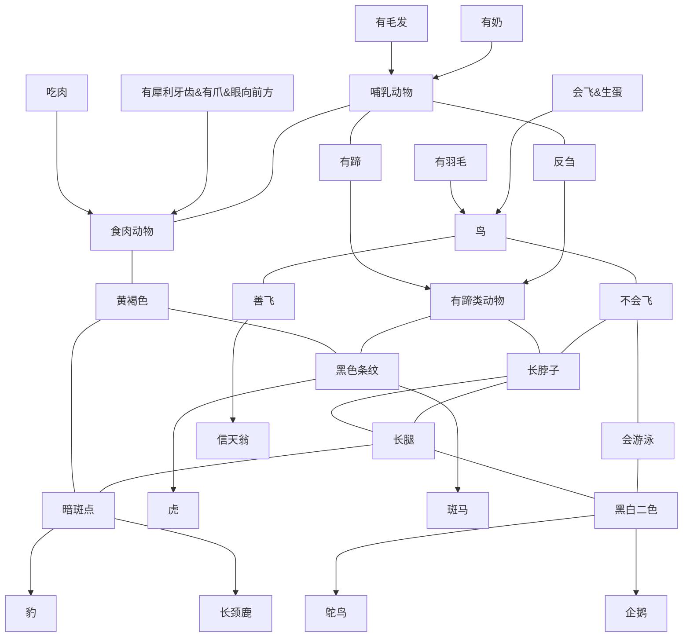

# 基于规则的产生式动物识别系统

## 实验目的

1. 通过简单动物识别系统的知识表示和推理程序的编写，加深理解产生式知识表示方法和推理
2. 学会使用产生式知识表示方法和推理解决实际问题

## 实验内容

- 动物识别专家系统是流行的专家系统实验模型，它用产生式规则来表示知识，共 15 条规则，设计一个用于动物识别的产生式系统，该系统通过规则库识别老虎、金钱豹、斑马、长颈鹿、企鹅、信天翁、鸵鸟 7 种动物。这些规则既少又简单，可以改造他们，也可以加进新的规则，还可以用来识别其他东西的新规则来取代这些规则。

## 实验要求

1. 确定推理方法（正向还是反向），并根据问题设计实现一个简单的不通用推理机（匹配、冲突消解）

2. 规则库要求至少包含 15 条规则

3. 初始事实可以任意给定，输入初始事实后能够得到推理结果

4. 设计人机界面，解释模块提供查询规则的功能

5. 可以不考虑知识库管理模块

6. 提交实验报告

7. 报告中要有推理树

## 实验代码

### 特征库

```cpp
// ignore `std::`
vector<string> features { "Have hair", "Have milk", "Have feather",
                          "Can lay eggs", "Eat meat", "Have sharp teeth",
                          "Have claws", "Eyes forward", "Have hooves",
                          "Rumination", "Tawny", "Dark spots", "Black bars",
                          "Long neck", "Long legs", "Can not fly",
                          "Can fly", "Black and white", "Can swim",
                          "Mammals", "Carnivores", "Ungulates", "Birds"
                        };
```

### 规则库

```cpp
std::vector<std::string> status { 
                                  // Mammals
                                  "10000000000000000000000",
                                  "01000000000000000000000",
                                  "00000000000000000001000",
                                  "10000000000000000001000",
                                  "01000000000000000001000",
                                  // Birds
                                  "00100000000000000000000",
                                  "00010000000000001000000",
                                  "00000000000000000000001",
                                  "00100000000000000000001",
                                  "00010000000000001000001",
                                  // Carnivores
                                  "00001000000000000000000",
                                  "00000111000000000000000",
                                  "00000000000000000000100",
                                  // Ungulates
                                  "00000000100000000001000",
                                  "10000000100000000000000",
                                  "01000000100000000000000",
                                  "00000000010000000001000",
                                  "10000000010000000000000",
                                  "01000000010000000000000",
                                  "00000000000000000000010",
                                  "10000000100000000001000",
                                  "01000000010000000001000",
                                  // R9
                                  "10001000001100000000000",
                                  "10000111001100000000000",
                                  "10000000001100000000100",
                                  "01001000001100000000000",
                                  "01000111001100000000000",
                                  "01000000001100000000100",
                                  "00001000001100000001000",
                                  "00000111001100000001000",
                                  "00000000001100000001100",
                                  "10001000001100000001000",
                                  "01001000001100000001000",
                                  "10000111001100000001000",
                                  "01000111001100000001000",
                                  "10000000001100000001100",
                                  "01000000001100000001100",
                                  // R10
                                  "10001000001010000000000",
                                  "10000111001010000000000",
                                  "10000000001010000000100",
                                  "01001000001010000000000",
                                  "01000111001010000000000",
                                  "01000000001010000000100",
                                  "00001000001010000001000",
                                  "00000111001010000001000",
                                  "00000000001010000001100",
                                  "10001000001010000001000",
                                  "01001000001010000001000",
                                  "10000111001010000001000",
                                  "01000111001010000001000",
                                  "10000000001010000001100",
                                  "01000000001010000001100",
                                  // R11
                                  "00000000100101100001000",
                                  "10000000100101100000000",
                                  "01000000100101100000000",
                                  "00000000010101100001000",
                                  "10000000010101100000000",
                                  "01000000010101100000000",
                                  "00000000000101100000010",
                                  // R12
                                  "00000000100010000001000",
                                  "10000000100010000000000",
                                  "01000000100010000000000",
                                  "00000000010010000001000",
                                  "10000000010010000000000",
                                  "01000000010010000000000",
                                  "00000000000010000000010",
                                  // R13
                                  "00100000000001110100000",
                                  "00000000000001110100001",
                                  "00100000000001110100001",
                                  // R14
                                  "00100000000000010110000",
                                  "00000000000000010110001",
                                  "00100000000000010110001",
                                  // R15
                                  "00100000000000001000000",
                                  "00010000000000001000000",
                                  "00000000000000001000001",
                                  "00100000000000001000001",
                                  "00010000000000001000001",
                                };
```

### 综合数据库

```cpp
std::vector<std::string> answer { "Sorry, I don't know...",
                                  "It is Leopard.",
                                  "It is Tiger.",
                                  "It is Giraffe.",
                                  "It is Zebra.",
                                  "It is Ostrich.",
                                  "It is Penguin.",
                                  "It is Albatross.",
                                  "It is Mammals.",
                                  "It is Carnivores.",
                                  "It is Ungulates.",
                                  "It is Birds."
                                };
```

### 推理机

```cpp
int solve() {
  std::string in;
  std::string mask("00000000000000000000000");
  while (std::cin >> in, in != "END") {
    auto it = in.begin();
    bool ok = true;
    while (it != in.end()) {
      ++it;
      if (std::isalpha(*it)) {
        ok = false;
        break;
      }
    }
    if (!ok) {
      std::cout << "Invalid enter, please check the input!" << std::endl;
      continue;
    }
    int idx = std::stoi(in);
    --idx;
    if (0 <= idx && idx < _SIZE_) {
      mask[idx] = '1';
    } else {
      std::cout << "Invalid enter, please check the input!" << std::endl;
      continue;
    }
  }
  int pos = -1;
  for (int x = 0; x < _COUNT_; x++) {
    if (mask == status[x]) {
      pos = x;
      break;
    }
  }
  if (0 <= pos && pos < 5) return 8;
  if (5 <= pos && pos < 10) return 11;
  if (10 <= pos && pos < 13) return 9;
  if (13 <= pos && pos < 22) return 10;
  if (22 <= pos && pos < 37) return 1;
  if (37 <= pos && pos < 52) return 2;
  if (52 <= pos && pos < 59) return 3;
  if (59 <= pos && pos < 66) return 4;
  if (66 <= pos && pos < 69) return 5;
  if (69 <= pos && pos < 72) return 6;
  if (72 <= pos && pos < 77) return 7;
  return 0;
}
```

### 程序入口

```cpp
int main() {
  std::cout << "Choose feature(s) of the animal you want to identify:" << std::endl;
  std::cout << "And type `END` to stop entering." << std::endl << std::endl;
  for (int id = 0; id < _SIZE_; id++) {
    int out = id + 1;
    if (out >= 10) {
      std::cout << out << ". ";
    } else {
      std::cout << "0" + std::to_string(out) << ". ";
    }
    std::cout << std::left << std::setw(20) << rules[id] << " \n"[out % 3 == 0];
  }
  std::cout << std::endl;
  int idx = solve();
  std::cout << std::endl;
  std::cout << "My answer is:" << std::endl;
  std::cout << answer[idx] << std::endl;
  return 0;
}
```

## 流程图


## 推理树



