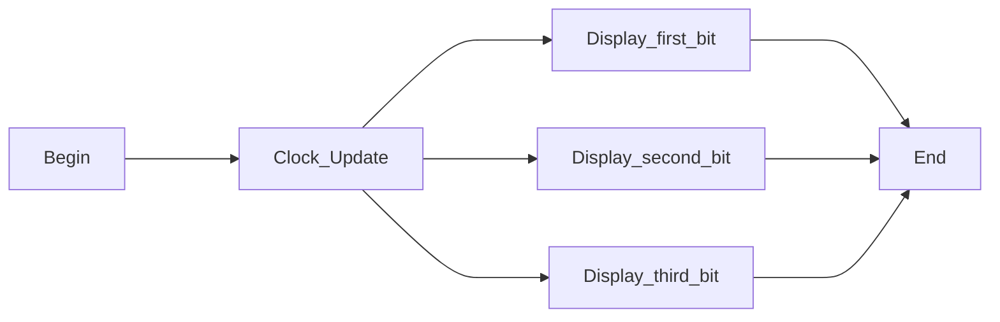
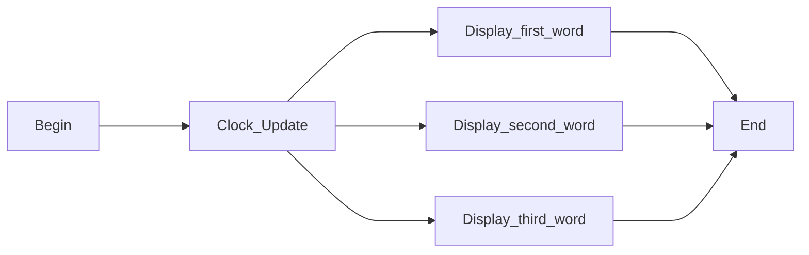
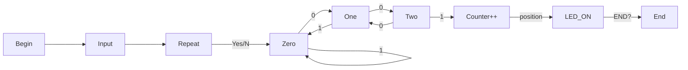
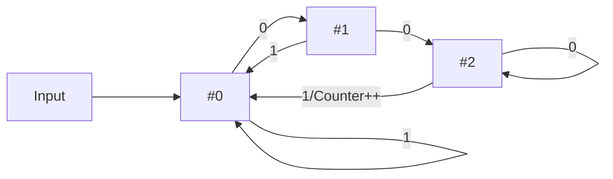
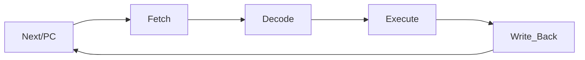

# 目录

## 1 在七段数码管上显示自己的最后三位学号数字

### 1.1 实验原理

### 1.2 程序功能流程图

### 1.3 设计及内部结构

### 1.4 VHDL源代码及解释

### 1.5 仿真结果展示

### 1.6 FPGA实验截图

### 1.7 问题描述及解决方案

## 2 在点阵上显示自己的名字

### 2.1 实验原理

### 2.2 程序功能流程图

### 2.3 设计及内部结构

### 2.4 VHDL源代码及解释

### 2.5 仿真结果展示

### 2.6 FPGA实验截图

### 2.7 问题描述及解决方案

## 3 封装/调用自己的IP Core

### 3.1 实验原理

### 3.2 程序功能流程图

### 3.3 设计及内部结构

### 3.4 VHDL源代码及解释

### 3.5 仿真结果展示

### 3.6 FPGA实验截图

### 3.7 问题描述及解决方案

## 4 序列检测器

### 4.1 实验原理

### 4.2 程序功能流程图

### 4.3 设计及内部结构

### 4.4 VHDL源代码及解释

### 4.5 仿真结果展示

### 4.6 FPGA实验截图

### 4.7 问题描述及解决方案

## 5 CPU实验报告

### 5.1 实验原理

### 5.2 程序功能流程图

### 5.3 设计及内部结构

### 5.4 VHDL源代码及解释

### 5.5 仿真结果展示

### 5.6 FPGA实验截图

### 5.7 问题描述及解决方案

<div style="page-break-after: always;"></div>

# 第一部分 实验报告

## 1 在七段数码管上显示自己的最后三位学号数字

### 1.1 实验原理

七段数码管是电子开发过程中常用的输出显示设备，其显示原理图类似于：

```shell
          0
	 ____
    5   |    |   1
         ____  6
    4   |    |   2
         ____
          3	     * dp
```

由a-f共7位数码管输出接收到的输入控制信号的图像，h为en即是否进行图像显示的控制接口。数码管和接口仅有0/1（即low/high电平）两种模式，由于七段数码管公共端连接到GND（共阴极），当数码管当中某一段被输入低电平，则这一段被点亮。


### 1.2 程序功能流程图



### 1.3 设计及内部结构


### 1.4 VHDL源代码及解释

> code.v

```verilog
`timescale 1ns / 1ps

/*
        ____    1
    0   |  |    2
        ----    6
    5   |  |    3
        ----    4
*/

module assignment_1 (
  input clk,
  output reg[2:0] sel,
  output reg[7:0] seg
);

initial begin
  sel = 3'b000;
end

always @(posedge clk)
  begin
    case(sel)
      3'b000 : begin seg = 8'b00000110; end  // 1
      3'b001 : begin seg = 8'b00111111; end  // 0
      3'b010 : begin seg = 8'b00000110; end  // 1
    endcase
    #1000

    sel = sel + 1'd1;
    if (sel > 3'd2) begin
      sel = 3'd0;
    end
    #1000;
  end

endmodule
```

> sim.v

```verilog
`timescale 1ns / 1ps

module assignment_1_tb ();

reg clk;
wire[7:0] seg;
wire[2:0] sel;

assignment_1 run (
  .clk(clk),
  .sel(sel),
  .seg(seg)
);

initial begin
  clk = 0;
end

always #10 clk = ~clk;

endmodule
```

### 1.5 仿真结果展示


### 1.6 FPGA实验截图


### 1.7 问题描述及解决方案

起初位数顺序弄混，导致输出结果出现混乱，找到上述数码管排列顺序资料后进行修改，即亮/灭的顺序为 $C_6, C_5, ..., C_0$ ；编写程序时忘记低电平显示，高电平不显示，也导致结果出现混乱，最终和上述问题一起得到纠正和修改，最终通过测试✅；

实验箱中的位数对应有错位，因此在设计时，想输出的数据需要进行相应顺序的调换，例如本人学号末尾三位数为 `110`，在设计时应该设计为 `101` ；

在测试时发现实验箱的数码管为高电平（1）亮低电平（0）不亮，我的设计相反导致显示异常，因此我写了一段程序解决此问题，即将原顺序输入，新顺序作为输出：

> invert.cpp

```cpp
/**
 *    author: Jingbo Su
 *    created: 05.09.2022 10:30:43
**/
#include <bits/stdc++.h>

using namespace std;

int main() {
  string s;
  while (getline(cin, s)) {
    int n = (int) s.size();
    string xs = "";
    for (int i = 0; i < n; i++) {
      if (s[i] == 'b') {
        xs = s.substr(i + 2, 7);
        for (int j = 0; j < (int) xs.size(); j++) {
          xs[j] ^= 1;
        }
        cout << "b0" + xs + ";" << '\n';
        break;
      }
      cout << s[i];
    }
  }
  return 0;
}
```

## 2 在点阵上显示自己的名字

### 2.1 实验原理

$16\times 16$ 扫描LED点阵工作原理与7段数码管相似，由 $16\times 16=256$ 个LED通过排列组合而成，俗称 $16\times 16$ 点阵。对于单个LED电路当 $R_n <- High$ 同时 $C_n <- Low$ 电路形成loop，LED点亮。每一行所有LED $R_n$ 端并联，每一列所有LED $C_n$ 端并联。通过给 $R_n$ 端高电平，这时只要某个 $C_n$ 端给出低电平，对应LED被点亮。

显示符号/汉字：通过汉字生成器生成姓名对应的点阵图，后按照其生成的排布顺序，输入在程序中模拟  $16\times 16$ 点阵。按照内部模拟的时钟信号逐行刷新，切换输入字；显示完整的字形的原理是利用人眼的视觉残留。

### 2.2 程序功能流程图



### 2.3 设计及内部结构


### 2.4 VHDL源代码及解释

> code.v

```verilog
`timescale 1ns/1ps

module assignment_2 (
  input clk,
  output reg[15:0] row,
  output reg[3:0] column
);

reg [15:0] row;
reg [3:0] column = 0;

integer total = 0;  // word library number
integer counter = 0; // counter for analog clock signal

always @(posedge clk) begin
  counter = counter + 1;
  if (counter == 5000) begin  // 0.5s
    counter = 0;
    total = total + 1;
  end
  if (total == 3) begin
    total = 0;
  end
end

always @(negedge clk) begin
  case (total)
    0: begin
      case (column)
        4'd0: begin row =  16'b00001000_00100000; end
        4'd1: begin row =  16'b00001000_00101000; end
        4'd2: begin row =  16'b11111111_11111110; end
        4'd3: begin row =  16'b00001000_00100000; end
        4'd4: begin row =  16'b00001010_00100000; end
        4'd5: begin row =  16'b00000010_00010000; end
        4'd6: begin row =  16'b00111111_11111000; end
        4'd7: begin row =  16'b00000010_00010000; end
        4'd8: begin row =  16'b00000010_00010000; end
        4'd9: begin row =  16'b00100010_00011000; end
        4'd10: begin row = 16'b00100100_00010110; end
        4'd11: begin row = 16'b01000100_00010010; end
        4'd12: begin row = 16'b00001000_00010000; end
        4'd13: begin row = 16'b00010000_00010000; end
        4'd14: begin row = 16'b00100000_01010000; end
        4'd15: begin row = 16'b01000000_00100000; end
      endcase
    end

    1: begin
      case (column)
        4'd0: begin row =  16'b00100000_01000000; end
        4'd1: begin row =  16'b00010000_01001000; end
        4'd2: begin row =  16'b00010011_11111100; end
        4'd3: begin row =  16'b11111100_01000000; end
        4'd4: begin row =  16'b00000011_11111000; end
        4'd5: begin row =  16'b01001000_01000000; end
        4'd6: begin row =  16'b01001111_11111110; end
        4'd7: begin row =  16'b01001000_00001000; end
        4'd8: begin row =  16'b01001011_11111100; end
        4'd9: begin row =  16'b00010010_00001000; end
        4'd10: begin row = 16'b00010011_11111000; end
        4'd11: begin row = 16'b00011110_00001000; end
        4'd12: begin row = 16'b11100011_11111000; end
        4'd13: begin row = 16'b01000010_00001000; end
        4'd14: begin row = 16'b00000010_00101000; end
        4'd15: begin row = 16'b00000010_00010000; end
      endcase
    end

    2: begin
      case (column)
      4'd0: begin row =  16'b00100000_01010000; end
      4'd1: begin row =  16'b00100000_01001000; end
      4'd2: begin row =  16'b00101111_11111110; end
      4'd3: begin row =  16'b00100000_01000000; end
      4'd4: begin row =  16'b00100111_11111100; end
      4'd5: begin row =  16'b11111100_01000100; end
      4'd6: begin row =  16'b00100111_11111100; end
      4'd7: begin row =  16'b00100100_01000100; end
      4'd8: begin row =  16'b00100111_11111100; end
      4'd9: begin row =  16'b00100100_01000100; end
      4'd10: begin row = 16'b00100000_00010000; end
      4'd11: begin row = 16'b00101111_11111110; end
      4'd12: begin row = 16'b00100010_00010000; end
      4'd13: begin row = 16'b00100001_00010000; end
      4'd14: begin row = 16'b00100000_01010000; end
      4'd15: begin row = 16'b00100000_00100000; end
      endcase
    end
  endcase
  
  column = column + 4'd1;
  if (column == 4'd16) begin
    column = 4'd0;
  end
end

endmodule
```

> sim.v

```verilog
`timescale 1ns / 1ps

module assignment_2_tb();

wire[15:0] row;
wire[3:0] column;
reg clk;

assignment_2 run(
  .clk(clk),
  .row(row),
  .column(column)
);

initial begin
  clk=0;
end

always #0.1 clk=~clk;

endmodule
```

### 2.5 仿真结果展示


### 2.6 FPGA实验截图

😅

### 2.7 问题描述及解决方案

由于选择的是行刷新方式，导致名字汉字横在屏幕上输出，但结果是正确的，无伤大雅；

如果实验箱上的频率选择不合适，会导致拍照不完整/录像时明显看出刷新迹象，可以通过调节实验箱频率以获得最佳拍照频率完成拍照✅；

可以通过调节实验箱频率以获得最佳拍照频率完成拍照✅；

初次设计时按照汉字生成器生成的点阵排布输出的名字是镜像的，不是很清楚原因不过写了一段程序将字符串特定部分进行reverse就成功地正确显示了✅;

> reverse.cpp

```cpp
/**
 *    author: Jingbo Su
 *    created: 08.08.2022 15:14:56
**/
#include <bits/stdc++.h>

using namespace std;

int main() {
  string s;
  while (getline(cin, s)) {
    bool b = false;
    int n = (int) s.size();
    for (int i = 0; i < n; i++) {
      string xs = "";
      if (s[i] == 'b' && !b) {
        cout << s[i];
        b = true;
        continue;
      }
      if (b && s[i] == 'b') {
        xs = s.substr(i + 1, 17);
        reverse(xs.begin(), xs.end());
        cout << 'b' << xs;
        i += 17;
        continue;
      }
      cout << s[i];
    }
    cout << endl;
  }
  return 0;
}
```


## 3 封装/调用自己的IP Core

### 3.1 实验原理

- 实验要求：调用自编写并封装的两位数二进制加法器的IP核，生成多位数的加法器

首先封装二进制加法器IP Core，我使用了前16道题中的二进制加法器，将其封装后，利用 **Vivado** 中 **Wrapper** 模块进行手动按照相应扩展逻辑，将四个相同2-bit二进制加法器IP Core连接成一个8-bit（多位）二进制加法器，最终通过测试。

### 3.2 程序功能流程图


### 3.3 设计及内部结构


### 3.4 VHDL源代码及解释

> code.v

```verilog
//Copyright 1986-2018 Xilinx, Inc. All Rights Reserved.
//--------------------------------------------------------------------------------
//Tool Version: Vivado v.2018.3 (win64) Build 2405991 Thu Dec  6 23:38:27 MST 2018
//Date        : Sun Sep  4 08:33:41 2022
//Host        : DESKTOP-D18RA48 running 64-bit major release  (build 9200)
//Command     : generate_target design_1_wrapper.bd
//Design      : design_1_wrapper
//Purpose     : IP block netlist
//--------------------------------------------------------------------------------
`timescale 1 ps / 1 ps

module design_1_wrapper
   (a_0,
    a_1,
    b_0,
    b_1,
    c_0,
    carry_0,
    sum_0,
    sum_1);
  input a_0;
  input a_1;
  input b_0;
  input b_1;
  input c_0;
  output carry_0;
  output sum_0;
  output sum_1;

  wire a_0;
  wire a_1;
  wire b_0;
  wire b_1;
  wire c_0;
  wire carry_0;
  wire sum_0;
  wire sum_1;

  design_1 design_1_i
       (.a_0(a_0),
        .a_1(a_1),
        .b_0(b_0),
        .b_1(b_1),
        .c_0(c_0),
        .carry_0(carry_0),
        .sum_0(sum_0),
        .sum_1(sum_1));
endmodule
```

> sim.v

```verilog
`timescale 1ns / 1ps

module sim_tb;

reg [1:0] a, b;
reg c;

wire [1:0] s;
wire co;

design_1_wrapper adder(
  .a_0(a[0]),
  .a_1(a[1]),
  .b_0(b[0]),
  .b_1(b[1]),
  .c_0(c),
  .sum_0(s[0]),
  .sum_1(s[1]),
  .carry_0(co)
);

  initial
  begin
    {a, b, c} = 5'b0;
    #1000 $finish;
  end

  always
  begin
    #10
    {a, b, c} = {a, b, c} + 1'b1;
  end

endmodule
```

### 3.5 仿真结果展示


### 3.6 FPGA实验截图


### 3.7 问题描述及解决方案

通过查阅资料学习到了IP Core的封装与调用以及Wrapper的使用。看到能通过画逻辑电路图使软件自动生成代码感觉到非常神奇🤗。

## 4 序列检测器

### 4.1 实验原理

- **Why Finite State Machine?**
    1. 有限状态机克服了纯硬件数字系统顺序方式控制不灵活的缺点
    2. 设计方案相对固定，结构模式简单，可定义符号化枚举类型的状态
    3. 状态机的Verilog描述层次分明，结构清晰，有助于阅读和理解
    4. 基于有限状态机技术设计的控制器其可靠性优于CPU
    5. 基于有限状态机技术设计的控制器其工作速度大大优于CPU
    6. 状态机是一类很重要的时序电路，相当于一个控制器，它将一项功能的完成分解为若干步，每一步对应于 *二进制* 的一个状态，通过预先设计的顺序在各状态之间进行转换，*状态转换* 的过程就是实现逻辑功能的过程

### 4.2 程序功能流程图



### 4.3 设计及内部结构

> 状态机(State Machine) 组成以及状态的转换是本实验的核心内容，将结果在七段数码管上显示是实验的辅助，锦上添花。




### 4.4 VHDL源代码及解释

> code.v

```verilog
`timescale 1ns / 1ps

module assignment_4 (
  input clk,
  input rst,
  input [7:0] in,
  output [7:0] seg,
  output [2:0] sel,
  output [7:0] out
);

reg[7:0] seg, out = 8'b00000000;
reg state;
reg[2:0] counter = 0;

assign sel = 0;

reg[1:0] current, next;
reg seq; // read sequence number

integer i;
// state
parameter Zero = 2'b00;
parameter One = 2'b01;
parameter Two = 2'b11;

// Update state
always @(posedge clk) begin
  counter = 0;
  if (rst == 1) begin
    current = next;
    i = 0;
  end
  else begin
    current = Zero;
    for(i = 0; i <= 7; i = i + 1) begin
      seq = in[i];  
      case (current)
        // State Zero
        Zero: begin
          if (seq == 0) begin
            next = One;
            state = 0;
          end
          else begin
            next = Zero;  // self loop
            state = 0;
          end
        end
        // State One
        One: begin
          if (seq == 0) begin
            next = Two;
            state = 0;
          end
          else begin
            next = Zero;
            state = 0;
          end
        end
        // State Two
        Two: begin
          if (seq == 1) begin
            next = Zero;
            state = 1;
            counter = counter + 1;
          end
          else begin
            next = Two; // self loop
            state = 0;
          end
        end
      endcase
      current = next;
      out[i] = state;
    end
    case (counter) // seven segment digit display
      3'd0: seg <= 8'b00111111;
      3'd1: seg <= 8'b00000110;
      3'd2: seg <= 8'b01011011;
      3'd3: seg <= 8'b01001111;
      3'd4: seg <= 8'b01100110;
      3'd5: seg <= 8'b01101101;
      3'd6: seg <= 8'b01111101;
      3'd7: seg <= 8'b00000111;
      default: seg <= 8'b00000000;
    endcase
  end
end

endmodule
```

> sim.v

```verilog
`timescale 1ns / 1ps

module assignment_4_tb();

reg clk;
reg rst = 0;
reg [7:0] in;
wire [7:0] seg;
wire [2:0] sel;
wire [7:0] out;

assignment_4 run (
  .clk(clk),
  .rst(rst),
  .in(in),
  .seg(seg),
  .sel(sel),
  .out(out)
);

initial begin
  clk = 1'b0;
  forever #10 clk = ~clk;
end
    
initial begin
  #100 in <= 8'b00100011;
  #100 rst = 1'b1;
  #50 rst = 1'b0;
  #100 rst = 1'b1;
  #50 rst = 1'b0;
  #100 $stop;
end

endmodule
```

### 4.5 仿真结果展示


### 4.6 FPGA实验截图


### 4.7 问题描述及解决方案

起初未加七段数码管作为输出，而是直接返回寄存器中值；也未设计Input Switch，无法在实验时进行动态输入，实验只能进行固定的、静态的数据测试，经过线上验机李阳老师的建议和指导，后期经过查询资料对其进行了改进。改进后的批注如上图所示。

## 5 CPU实验报告

### 5.1 实验原理


#### 5.1.1 对CPU的操作码进行详细的描述

> 操作码指计算机程序中所规定的要执行操作的那一部分指令或字段(通常用代码表示)，其实就是指令序列号，用来告诉CPU需要执行哪一条指令。

#### 5.1.2 对CPU的功能码进行详细的描述

> 功能码用于标明一个Modbus信息帧的用途，如功能码01为读取线圈状态，02为读取输入状态等。当主设备向从设备发送信息时，功能码将告诉从设备需要执行哪些行为。例如，去读取输入的开关状态、读一组寄存器的数据内容等。当从设备响应时，使用功能码用于指示是正常响应(无误)还是有某种错误发生(称作异议回应)。正常应答时，主机发送的功能码等于从机应答的功能码.

#### 5.1.3 对CPU的指令及操作码进行分类

1. $R-type$ Instruction

    **op: [000000]**

    1. ALU (`add(u), sub(u), and, or, xor, nor`)

        ```verilog
        func[5] = 1
        
        control_a <= 0;   // from reg_1
        control_b <= 0;   // from reg_2
        mem_write <= 0;   // no need to write to memory
        reg_write <= 1;   // write into reg
        mem_to_data <= 0; // don't access memory
        sign_ext <= 0;    // don't extend sign
        dest <= 1;        // to rd
        jal <= 0;
        next_op <= 2'b00;
        
        case (func[3:0])
          4'b0000: alu_op <= 4'b0000;   // add
          4'b0001: alu_op <= 4'b0000;   // addu
          4'b0010: alu_op <= 4'b0001;   // sub
          4'b0011: alu_op <= 4'b0001;   // subu
          4'b0100: alu_op <= 4'b0010;   // and
          4'b0101: alu_op <= 4'b0011;   // or
          4'b0110: alu_op <= 4'b0100;   // xor
          4'b0111: alu_op <= 4'b0101;   // nor
          4'b1010: alu_op <= 4'b0110;   // slt
          4'b1011: alu_op <= 4'b0110;   // sltu
          default: alu_op <= 4'b1111;
        endcase
        ```

    2. $jr$ instruction (`jr`)  [001000]

        ```verilog
        func[5] = 0
        func[3] = 1
        
        control_a <= 0;
        control_b <= 0;
        mem_write <= 0;
        reg_write <= 0; // do not write data
        mem_to_data <= 0;
        sign_ext <= 0;
        dest <= 0;  // rd
        jal <= 0;
        next_op <= 2'b11; // jump
        alu_op <= 4'b1111;  // do nothing
        ```

    3. $shift$ instruction (`slt(u), sll(v), srl(v), sra(v)`)

        ```verilog
        func[5:3] = 3'b000
        func[2] = 0: incorporate shamt
        func[2] = 1: without shamt
        
        control_b <= 0;
        mem_write <= 0;
        reg_write <= 1;   // write into reg
        mem_to_data <= 0;
        sign_ext <= 0;
        dest <= 1;  // rd
        jal <= 0;
        next_op <= 2'b00;
        
        case (func[1:0])
          2'b00: alu_op <= 4'b0111; // sll & sllv
          2'b10: alu_op <= 4'b1000; // srl & srlv
          2'b11: alu_op <= 4'b1001; // sra & srav
         endcase
        ```

2. $J-type$ Instruction (`j, jal`)

    **op[5:1] = [00001]**

    ```verilog
    op[0] = 1
    
    // jal instruction
    control_a <= 0;
    control_b <= 0;
    mem_write <= 0;
    reg_write <= 1; // write into rs
    mem_to_data <= 0;
    sign_ext <= 0;
    dest <= 0;  // rt
    jal <= 1;
    next_op <= 2'b10; // j & jal
    alu_op <= 4'b1111;  // do nothing
    
    // j instruction
    control_a <= 0;
    control_b <= 0;
    mem_write <= 0;
    reg_write <= 0;
    mem_to_data <= 0;
    sign_ext <= 0;
    dest <= 0;  // rd
    jal <= 0;
    next_op <= 2'b10; // j & jal
    alu_op <= 4'b1111;  // do nothing
    ```

3. $I-type$ Instruction

    **op[5:3] = [001]**

    ```verilog
    control_a <= 0;
    control_b <= 1; // $ext_imm instead of reg_2
    mem_write <= 0;
    reg_write <= 1; // write into reg
    mem_to_data <= 0;
    dest <= 0;  // rd
    jal <= 0;
    next_op <= 2'b00;
    ```

    ```verilog
    case (op[2:0])
        // addi
        3'b000: begin
          alu_op <= 4'b0000;
          sign_ext <= 1;
        end
        // addiu
        3'b001: begin
          alu_op <= 4'b0000;
          sign_ext <= 1;
        end
        // andi
        3'b100: begin
          alu_op <= 4'b0010;
          sign_ext <= 0;
        end
        // ori
        3'b101: begin
          alu_op <= 4'b0011;
          sign_ext <= 0;
        end
        // xori
        3'b110: begin
          alu_op <= 4'b0100;
          sign_ext <= 0;
        end
        // lui
        3'b111: begin
          alu_op <= 4'b1010;
          sign_ext <= 0;
        end
        // slti
        3'b010: begin
          alu_op <= 4'b0110;
          sign_ext <= 1;
        end
        // sltiu
        3'b011: begin
          alu_op <= 4'b0110;
          sign_ext <= 0;
        end
    endcase
    ```

4. $Load$ and $Store$ Instruction (`lw, sw`)

    **Require to access memory!**

    **op[5:4] = [10] && op[2:0] = [011]**

    ```verilog
    control_a <= 0;
    control_b <= 1; // $imm instead of rd
    mem_write <= 0;
    sign_ext <= 1;
    dest <= 0;  // rd
    jal <= 0;
    next_op <= 2'b00; // j & jal
    alu_op <= 4'b0000;  // do nothing
    ```

    ```verilog
    op[3] = 1
    mem_write <= 1;
    reg_write <= 0;
    
    op[3] = 0
    mem_write <= 0;
    reg_write <= 1;
    ```

5. $Condition\ Statement$ Instruction (`beq, bne`)

    **op[5:1] = [00010]**

    ```verilog
    control_a <= 0;
    control_b <= 0;
    mem_write <= 0;
    reg_write <= 0;
    mem_to_data <= 0;
    sign_ext <= 0;
    dest <= 0;
    jal <= 0;
    alu_op <= 4'b0001;
    ```

    ```verilog
    // bne: if rt != rs, then (PC)<-(PC) + 4 + (sign-extend-offset << 2)
    op[0] = 1
      if (eq) next_op <= 2'b00;
      else next_op <= 2'b01;  // not equal
    
    op[0] = 0
      if (eq) next_op <= 2'b01; // equal
      else next_op <= 2'b00;
    ```

### 5.2 程序功能流程图



### 5.3 设计及内部结构


### 5.4 VHDL源代码及解释

#### alu.v

```verilog
/*
    file: alu.v
    author: Jingbo Su
    created: August 2022
*/

module ALU(
  output reg[31:0] alu_result,
  output wire eq,
  input wire[31:0] a,
  input wire[31:0] b,
  input wire[3:0] alu_op
);

reg[32:0] val;

always @(a or b or alu_op) begin
  case (alu_op)
    4'b0000: alu_result = a + b;    // add
    4'b0001: alu_result = a - b;    // sub
    4'b0010: alu_result = a & b;    // and
    4'b0011: alu_result = a | b;    // or
    4'b0100: alu_result = a ^ b;    // xor
    4'b0101: alu_result = !(a | b); // nor
    4'b0110: begin                  // slt: select less
      val = {a[31], a} - {b[31], b};// {ex-sign, 32-bit val}
      alu_result = 32'd0 | val[32];
    end
    4'b0111: alu_result = b << a;   // sll, sllv
    4'b1000: alu_result = b >> a;   // srl, srlv
    4'b1001: alu_result = b >>> a;  // sal, srav
    4'b1010: alu_result = b << 16;  // lui
    4'b1111:;
  endcase
end
assign eq = (a == b ? 1 : 0);

endmodule
```

#### controller.v

```verilog
/*
    file: controller.v
    author: Jingbo Su
    created: August 2022
*/

module Controller (
  output reg control_a,   // control_a: 0: reg_1, 1: shamt shift
  output reg control_b,   // control_b: 0: reg_2, 1: immediate extend
  output reg mem_write,   // enable write to memory
  output reg reg_write,   // enable write to register
  output reg mem_to_data, // pass data as memory to Data Memory
  output reg sign_ext,    // extend sign or not
  output reg dest,    // destination register, 1: rd 0: rt
  output reg jal,
  output reg[3:0] alu_op,
  output reg[1:0] next_op,

  input wire[5:0] op,
  input wire[5:0] func,
  input wire eq
);

always @(op or func or eq) begin
  // R type instruction (op = [000000])
  if (op == 6'b000000) begin
    // ALU
    if (func[5]) begin
      control_a <= 0;   // from reg_1
      control_b <= 0;   // from reg_2
      mem_write <= 0;   // no need to write to memory
      reg_write <= 1;   // write into reg
      mem_to_data <= 0; // don't access memory
      sign_ext <= 0;    // don't extend sign
      dest <= 1;        // to rd
      jal <= 0;
      next_op <= 2'b00;

      case (func[3:0])
        4'b0000: alu_op <= 4'b0000;   // add
        4'b0001: alu_op <= 4'b0000;   // addu
        4'b0010: alu_op <= 4'b0001;   // sub
        4'b0011: alu_op <= 4'b0001;   // subu
        4'b0100: alu_op <= 4'b0010;   // and
        4'b0101: alu_op <= 4'b0011;   // or
        4'b0110: alu_op <= 4'b0100;   // xor
        4'b0111: alu_op <= 4'b0101;   // nor
        4'b1010: alu_op <= 4'b0110;   // slt
        4'b1011: alu_op <= 4'b0110;   // sltu
        default: alu_op <= 4'b1111;
      endcase
    end
    else begin
      // jr instructions  [001000]
      if (func[3]) begin
        control_a <= 0;
        control_b <= 0;
        mem_write <= 0;
        reg_write <= 0; // do not write data
        mem_to_data <= 0;
        sign_ext <= 0;
        dest <= 0;  // rd
        jal <= 0;
        next_op <= 2'b11; // jump
        alu_op <= 4'b1111;  // do nothing
      end
      // shift instructions
      else if (func[5:3] == 3'b000) begin
        if (func[2])  control_a <= 1; // incorporate shamt
        else  control_a <= 0; // without shamt

        control_b <= 0;
        mem_write <= 0;
        reg_write <= 1;   // write into reg
        mem_to_data <= 0;
        sign_ext <= 0;
        dest <= 1;  // rd
        jal <= 0;
        next_op <= 2'b00;

        case (func[1:0])
          2'b00: alu_op <= 4'b0111; // sll & sllv
          2'b10: alu_op <= 4'b1000; // srl & srlv
          2'b11: alu_op <= 4'b1001; // sra & srav
        endcase
      end
    end
  end
  // J type instructions
  else if (op[5:1] == 5'b00001) begin
    // jal instruction [000011]
    if (op[0]) begin
      control_a <= 0;
      control_b <= 0;
      mem_write <= 0;
      reg_write <= 1; // write into rs
      mem_to_data <= 0;
      sign_ext <= 0;
      dest <= 0;  // rt
      jal <= 1;
      next_op <= 2'b10; // j & jal
      alu_op <= 4'b1111;  // do nothing
    end
    // j instruction [000010]
    else begin

      control_a <= 0;
      control_b <= 0;
      mem_write <= 0;
      reg_write <= 0;
      mem_to_data <= 0;
      sign_ext <= 0;
      dest <= 0;  // rd
      jal <= 0;
      next_op <= 2'b10; // j & jal
      alu_op <= 4'b1111;  // do nothing
    end
  end
  // I type instructions
  else begin
    if (op[5:3] == 3'b001) begin

      control_a <= 0;
      control_b <= 1; // $ext_imm instead of reg_2
      mem_write <= 0;
      reg_write <= 1; // write into reg
      mem_to_data <= 0;
      dest <= 0;  // rd
      jal <= 0;
      next_op <= 2'b00;
      
      case (op[2:0])
        // addi
        3'b000: begin
          alu_op <= 4'b0000;
          sign_ext <= 1;
        end
        // addiu
        3'b001: begin
          alu_op <= 4'b0000;
          sign_ext <= 1;
        end
        // andi
        3'b100: begin
          alu_op <= 4'b0010;
          sign_ext <= 0;
        end
        // ori
        3'b101: begin
          alu_op <= 4'b0011;
          sign_ext <= 0;
        end
        // xori
        3'b110: begin
          alu_op <= 4'b0100;
          sign_ext <= 0;
        end
        // lui
        3'b111: begin
          alu_op <= 4'b1010;
          sign_ext <= 0;
        end
        // slti
        3'b010: begin
          alu_op <= 4'b0110;
          sign_ext <= 1;
        end
        // sltiu
        3'b011: begin
          alu_op <= 4'b0110;
          sign_ext <= 0;
        end
      endcase
    end
    // load & store instruction
    else if (op[5:4] == 2'b10 && op[2:0] == 3'b011) begin
      control_a <= 0;
      control_b <= 1; // $imm instead of rd
      mem_write <= 0;
      sign_ext <= 1;
      dest <= 0;  // rd
      jal <= 0;
      next_op <= 2'b00; // j & jal
      alu_op <= 4'b0000;  // do nothing

      // sw: fetch data from reg and write into memory
      if (op[3]) begin
        mem_write <= 1;
        reg_write <= 0;
      end
      // lw: fetch data from memory and write into reg
      else begin
        mem_write <= 0;
        reg_write <= 1;
      end
    end
    // condition branch instructions
    else if (op[5:1] == 5'b00010) begin
      control_a <= 0;
      control_b <= 0;
      mem_write <= 0;
      reg_write <= 0;
      mem_to_data <= 0;
      sign_ext <= 0;
      dest <= 0;
      jal <= 0;
      alu_op <= 4'b0001;

      // bne: if rt != rs, then (PC)<-(PC) + 4 + (sign-extend-offset << 2)
      if (op[0]) begin
        if (eq) next_op <= 2'b00;
        else next_op <= 2'b01;  // not equal
      end
      // beq: if rt == rs, then (PC)<-(PC) + 4 + (sign-extend-offset << 2)
      else begin
        if (eq) next_op <= 2'b01; // equal
        else next_op <= 2'b00;
      end
    end
  end
end

endmodule
```

#### cpu.v

```verilog
/*
    file: cpu.v
    author: Jingbo Su
    created: August 2022
*/

module CPU (
  input wire clk,
  input wire rst,
  output wire[2:0] sel,
  output wire[7:0] seg
);

wire[31:0] pc, next;
wire[31:0] instruction;
wire[31:0] reg_result, mem_result;

wire control_a, control_b;
wire mem_write, reg_write;
wire mem_to_data;
wire sign_ext;
wire dest;
wire jal;
wire[3:0] alu_op;
wire[1:0] next_op;

wire[4:0] reg_1_sel, reg_2_sel, w_sel;
wire[31:0] data, reg_1, reg_2;
wire[4:0] final;  // select destination is rt or rd

wire[31:0] shamt, ex_imm;

wire[31:0] A, B, alu_result;
wire eq;

wire[31:0] read, write;

// fetch instructions
PC fetch (
  .next(pc),
  .current(next), // next = pc + 4 first, if seq won't jump
  .clk(clk),
  .rst(rst)
);

// calculate next instruction (seq or jmp)
NEXT jump (
  .pc(pc),
  .next(next),
  .imm_i_16(instruction[15:0]), // beq & bne
  .imm_r_26(instruction[25:0]), // j & jal
  .rs(reg_1),
  .next_op(next_op)
);

// controller
Controller control (
  // pins and wires have the same name can be writen implicitly in .name connections
  // why it does not work???
  .control_a(control_a),
  .control_b(control_b),
  .mem_write(mem_write),
  .reg_write(reg_write),
  .mem_to_data(mem_to_data),
  .sign_ext(sign_ext),
  .dest(dest),
  .jal(jal),
  .alu_op(alu_op),
  .next_op(next_op),
  .op(instruction[31:26]),
  .func(instruction[5:0]),
  .eq(eq)
);

assign reg_1_sel = instruction[25:21];  // rs
assign reg_2_sel = instruction[20:16];  // rt

wire[31:0] res;

// registers
Regs regs (
  .reg_1(reg_1),
  .reg_2(reg_2),
  .res(res),
  .reg_1_sel(reg_1_sel),
  .reg_2_sel(reg_2_sel),
  .en(reg_write),
  .write_sel(w_sel),
  .write_data(data),
  .clk(clk)
);

wire[11:0] val;
assign val = res[11:0];

// execution process
// all pins and wires have the same name
// this is the most powerful form of implicit association
// its best reserved for use at the top level testbench/top module
// why ALU alu_0(.*) does not work???

ALU alu (
  .a(A),
  .b(B),
  .alu_op(alu_op),
  .eq(eq),
  .alu_result(alu_result)
);

// access instruction memory
Instructon_Memory insm (
  .pos(pc),
  .read(instruction)
);

// access data memory
Data_Memory datam (
  .pos(alu_result),
  .write(reg_2),
  .ret(read),
  .en(mem_write),
  .clk(clk)
);

// in the module declaration, the keyword `parameter` is not required
// it does read more clearly however!
MUX #(.in_width(5)) MUX_0 (
  // select dest_reg: rt or rd
  .out(final),
  .in0(instruction[20:16]),
  .in1(instruction[15:11]),
  .sel(dest)
);

MUX #(.in_width(5)) MUX_1 (
  // select jr: goto $31 or not
  .out(w_sel),
  .in0(final),
  .in1(31),
  .sel(jal)
);

MUX #(.in_width(32)) MUX_2 (
  // select where to write data: next or write back
  .out(data),
  .in0(write),
  .in1(next),
  .sel(jal)
);

MUX #(.in_width(32)) MUX_3 (
  // select ordinary or (shamt) shift operation
  .out(A),
  .in0(reg_1),
  .in1(shamt),
  .sel(control_a)
);

MUX #(.in_width(32)) MUX_4 (
  // select ordinary or (I-type / J-type) needs extend immediate operation
  .out(B),
  .in0(reg_2),
  .in1(ex_imm),
  .sel(control_b)
);

MUX #(.in_width(32)) MUX_5 (
  // select write data of the reg or address in memory as the data of the reg...
  .out(write),
  .in0(alu_result),
  .in1(read),
  .sel(mem_to_data)
);

// handling $imm in instructions
// in the module declaration, the keyword `parameter` is not required
// it does read more clearly however!
Extend #(.in_width(5)) Extend_0 (
  // shamt(shift amount) extend: 5-bit->32-bit
  // sll & srl & sra
  .result(shamt),
  .in(instruction[10:6]),
  .sign_ext(0)  // no sign extend
);

Extend #(.in_width(16)) Extend_1 (
  // immediate extend: 16-bit->32-bit
  .result(ex_imm),
  .in(instruction[15:0]),
  .sign_ext(sign_ext)   // sign extend
);

SEG seven_seg (
  .clk(clk),
  .val(val),
  .sel(sel),
  .seg(seg)
);

// check halt intruction
always @(*) begin
  if(instruction == 32'hffffffff) begin
    $finish;
  end
end

endmodule
```

#### extend.v

```verilog
/*
    file: extend.v
    author: Jingbo Su
    created: August 2022
*/

module Extend #(
  parameter in_width = 16,
  parameter out_width = 32
) (
  // parameterization of modules allows for module reuse powerfully!

  // zero/sign extend from 16-bit to 32-bit
  output wire[out_width-1:0] result,
  input wire[in_width-1:0] in,
  input wire sign_ext
);

reg [out_width-in_width-1:0] ext_bit; // extend bits

always @(in or sign_ext) begin
  // use if...else instead of an MUX
  if (sign_ext) begin
    // sign extend
    if (in[in_width - 1]) ext_bit = 32'd0 - 1; // negitive
    else ext_bit = 0; // positive
  end
  else ext_bit = 0; // zero extend
end

assign result = {ext_bit, in};

endmodule
```

#### memory.v

```verilog
/*
    file: memory.v
    author: Jingbo Su
    created: August 2022
*/

module Data_Memory (
  output wire[31:0] ret,
  input wire[31:0] write,
  input wire[31:0] pos,
  input wire en,
  input wire clk
);
    

localparam width = 6'b111111;
reg[7:0] mem[0:width];

//* for test
initial begin
  $readmemh("../../../../test/data.in", mem);
end

assign ret = {mem[pos], mem[pos + 1], mem[pos + 2], mem[pos + 3]}; // jr: (PC) <- (rs)

always @(negedge clk) begin
  if (en) begin
    // write data into memory
    // Big end [v0, v1, v2, v3]
    mem[pos + 0] <= write[31:24];
    mem[pos + 1] <= write[23:16];
    mem[pos + 2] <= write[15:8];
    mem[pos + 3] <= write[7:0];
  end
end

endmodule

module Instructon_Memory (
  output wire[31:0] read,
  input wire[31:0] pos
);

localparam integer width = 6'b111111;
reg[7:0] mem[0:width];

// read data from memory
assign read = {mem[pos], mem[pos + 1], mem[pos + 2], mem[pos + 3]};

//* for test
initial begin
  $readmemh("../../../../test/ins.in", mem);
end

endmodule
```

#### mux.v

```verilog
/*
    file: mux.v
    author: Jingbo Su
    created: August 2022
*/

module MUX #(parameter in_width = 32
) (
  // parameterization of modules allows for module reuse powerfully!
  output reg[in_width-1:0] out,
  input wire[in_width-1:0] in0,
  input wire[in_width-1:0] in1,
  input wire sel
);

always @(in0 or in1 or sel) begin
  // if sel == 1, select in1, otherwise select in0
  if (sel) out = in1;
  else out = in0;
end

endmodule
```

#### pc.v

```verilog
/*
    file: pc.v
    author: Jingbo Su
    created: August 2022
*/

module PC (
  output reg[31:0] next,
  input wire[31:0] current,
  input wire clk,
  input wire rst
);

always @(posedge clk or negedge rst) begin
  if (!rst) next = 0;
  else if (clk) next = current;
end

endmodule

// NEXT module: what pc will be next step
module NEXT (
  output reg[31:0] next,
  input wire[31:0] pc,
  input wire[15:0] imm_i_16,  // op: 6-bit, imm: 16-bit, I-type instruction (immediate)
  input wire[25:0] imm_r_26,  // op: 6-bit, imm: 26-bit, J-type instruction (address)
  input wire[31:0] rs,        // register rs
  input wire[1:0] next_op
);

wire[31:0] ex_imm16, ex_imm26;

Extend #(.in_width(16)) Extend_0 (
  // parameterization of modules allows for module reuse powerfully!
  .in(imm_i_16),
  .sign_ext(imm_i_16[15]),
  .result(ex_imm16)
);
Extend #(.in_width(26)) Extend_1 (
  .in(imm_r_26),
  .sign_ext(imm_r_26[25]),
  .result(ex_imm26)
);

always @(pc or imm_i_16 or imm_r_26 or rs or next_op) begin
  case (next_op)
    2'b00: next = pc + 4; // seq-instructions
    2'b01: next = pc + 4 + (ex_imm16 << 2); // beq & bne
    2'b10: next = ex_imm26 << 2;  // j & jal
    2'b11: next = rs; // jr
    default: ;
  endcase
end

endmodule
```

#### regs.v

```verilog
/*
    file: regs.v
    author: Jingbo Su
    created: August 2022
*/

module Regs(
  output wire[31:0] reg_1,
  output wire[31:0] reg_2,
  output wire[31:0] res,
  input wire[4:0] reg_1_sel,
  input wire[4:0] reg_2_sel,
  input wire en,
  input wire[4:0] write_sel,
  input wire[31:0] write_data,
  input wire clk
);

reg[31:0] regs[0:31]; // 32 register group

assign reg_1 = regs[reg_1_sel];
assign reg_2 = regs[reg_2_sel];
assign res = regs[3];

integer i;
initial begin
  for(i = 0; i < 32; i = i + 1) begin
    regs[i] = i;
  end
end

always @(negedge clk) begin
  // write data into registers
  if (en) regs[write_sel] <= write_data;
end

endmodule
```

#### seg.v

```verilog
/*
    file: seg.v
    author: Jingbo Su
    created: August 2022
*/

`timescale 1ns / 1ps

module SEG (
  input clk,
  input wire[11:0] val,
  output reg[2:0] sel,
  output reg[7:0] seg
);

initial begin
  sel = 3'b100;
end

reg[3:0] data = 0;

always @(posedge clk) begin
  case (sel)
    3'b100 : begin data = val[3:0]; end
    3'b101 : begin data = val[11:8]; end
    3'b110 : begin data = val[7:4]; end
  endcase

  sel = sel + 1'd1;
  if (sel > 3'd6) begin
    sel = 3'd4;
  end

end

always @(posedge clk) begin
  case(data)
    4'h0: seg = 8'b00111111;
    4'h1: seg = 8'b00000110;
    4'h2: seg = 8'b01011011;
    4'h3: seg = 8'b01001111;
    4'h4: seg = 8'b01100110;
    4'h5: seg = 8'b01101101;
    4'h6: seg = 8'b01111101;
    4'h7: seg = 8'b00000111;
    4'h8: seg = 8'b01111111;
    4'h9: seg = 8'b01101111;
    4'ha: seg = 8'b01110111;
    4'hb: seg = 8'b01111100;
    4'hc: seg = 8'b00111001;
    4'hd: seg = 8'b01011110;
    4'he: seg = 8'b01111001;
    4'hf: seg = 8'b01000000;
  endcase
end

endmodule
```

#### cpu_tb.v

```verilog
/*
    file: cpu_tb.v
    author: Jingbo Su
    created: August 2022
*/

`timescale 1ns / 1ps

module cpu_tb();
reg clk, rst;

wire[2:0] sel;
wire[7:0] seg;

initial begin
  clk = 1;
  rst = 0;
  #1 rst = 1;
  #999 $finish;
end
  
always #1 clk = ~clk;
  
CPU cpu(
  .clk(clk),
  .rst(rst),
  .sel(sel),
  .seg(seg)
);

endmodule
```

**CPU Test Sample**

- ins.in

> details in [here](https://gitee.com/ShangaNana/hardware-course-design-ncut/issues/I5OG99)

```c
// add from 1 to 10
// add $1, $2, $3 00000 100000
// addi $1, $2, $imm ($1 = $2 + $imm)
// xor $1, $1, $1 00000 100110
// xor reg itself => zero reg

// instructions
@0000   00 21 08 26  // xor $1, $1, $1
@0004   00 42 10 26  // xor $2, $2, $2
@0008   00 63 18 26  // xor $3, $3, $3
@000C   20 42 00 0A  // addi $2, $2, 10
@0010   20 21 00 01  // addi $1, $1, 1
@0014   00 23 18 20  // add $3, $1, $3
@0018   14 22 FF FD  // bne $1, $2, -2
@001C   FF FF FF FF  // halt
```

- gen.py

> generate random data memory for data memory accessing...

```python
from random import random

for i in range(16384):
  res = ''
  for j in range(4):
    rand = int(random() * 16)
    n = ''
    if rand < 10:
      n = str(rand)
    else:
      k = rand - 10
      n = chr(ord('A') + k)

    rand = int(random() * 16)
    m = ''
    if rand < 10:
      m = str(rand)
    else:
      k = rand - 10
      m = chr(ord('A') + k)

    res = res + n
    res = res + m
    if j < 3:
      res = res + ' '

  print(res)
```

### 5.5 仿真结果展示


### 5.6 FPGA实验截图


### 5.7 问题描述及解决方案

起初对CPU整体结构没有很好的把握，浪费了很多时间在系统设计上，最后决定对上学期学习的计算机组成原理一书中的CPU模型进行分析及改进；回到学校后，和同学共同探讨，对31条指令按类别进行了细致的分类，最后可以在case中对不同的指令进行归类和实现。后期模拟计算机内存随机生成了一份内存映射，还根据指令规律生成了一份测试指令来模拟实现 $1 + 2 + \cdots + 10$ 操作（[details](https://gitee.com/ShangaNana/hardware-course-design-ncut/issues/I5OG99))（通过 `$readmemh("<path>", mem);` 指令读入指令/内存）。还与同学交换了test sample进行多组测试📄。

‼️ ***Tip*** 最初上机时，花了两小时在本地和机房电脑中跑synthesis结构都没有跑出来（也没有errors），经过廖联军老师的提示，我将 `memory.v` 中 $mem$ 数组宽度从 `0xffff` 调整为 `6'b111111` 成功完成  ***synthesis*** and ***bitstream***上传。之所以失败我猜想可能由于测试机无法支持如此大的数组内存开销；之所以成功因为我并没有测试我的访存指令（`load` and `store`），即使我有生成模拟内存。若后续想要复现，务必要修改内存大小！！！

⁉️ ***Puzzle*** 在后续添加的 `seg.v` 七段数码管文件中，可以在 ***simulation*** 中清楚看到 $val$ 数组结果为寄存器 $regs[3]$ 中的结果 `0x037`，然而经过片选器片选后在实验箱上只能跑出 `003` 即中间位的结果，当我讲结果 `0x037` 写死到片选信号时便可成功输出，这证明了不是频率选择问题，但又不知有什么问题🤔️。因此留下的这个问题令我感到非常困惑...希望可以理解我的意思的老师同学能够给予我提示与帮助，感激不尽。

<div style="page-break-after: always;"></div>

# 第二部分 总结（个人心得）

首先感谢各位负责的老师的辛苦付出，即使几乎小学期所有的时间都在线上，但是老师们时刻不忘叮嘱我们按时完成任务。在实验阶段，李阳老师每天都会在上午/下午固定时间预约3-4小时的会议督促大家进行实验；在验机阶段，李阳老师每天从早到晚都会开放线上实验室供大家验机，并且在验机时给出自己细致的建议和合理的指导，因此我非常感激老师的付出，为了我们在计算机底层硬件领域有所收获，提升自己的综合能力。

经过了前后整整6星期的实验和开学后的验机，我已基本掌握了Vivado平台的使用方法以及Verilog语言的编写，例如compile、debug、simulation以及管脚绑定和查看波形图等等操作，收获颇丰。我最开始甚至不会simulation，甚至IP Core的封装和调用都需要请教老师和同学的帮助。我也不断在互联网上搜寻教程和出现问题的解决方法，还从资料和同学那里学会了很多新技巧，例如MUX中设置local parameter以更好的reuse，以及简单的初始化方法...

在编写七段数码管和 $16 \times 16$ 点阵时，有时不能按照预定的显示方式显示时，除了想到自己代码本身的语法和逻辑错误，还有可能是显示频率设定有误。关于显示频率一直是很神奇的东西对我来说在一开始的时候，出现了一些问题时，可能将时钟输入频率调整一下便可观察到理想的结果。

编写CPU是十分困难的对我来说非常痛苦，但是多亏了互联网和其他资料的帮助，对我来说最终完成CPU实验最有用的两个资源是计算机的体系结构即CPU结构，当结构确定下来后，程序编写变得理所当然；另一个是指令文档，按照文档仔细进行逐一的分类和实现，有许多程序和结构上的细节都可以借助万能的互联网找到解决方案，丰富了我的知识储备，开阔了我的视野，也训练了我在线独立搜索解决方法的能力，收获颇丰。

如果管脚绑定没有仔细检查认真操作导致错误的出现往往不易察觉，在反反复复检查多遍自己写的代码后依旧没有解决问题，这时候应该检查自己的管脚绑定，不能只看管脚绑定前或后出现✔️就认为自己的管脚绑定万无一失，因为它不会自己进行逻辑判断检查正误。例如如果不指定管脚类型，其会出现红色的`default`字样，导致bitstream生成失败。尤其在编译仿真结果正确时，试验箱没能显示预期结果，应想到管脚绑定问题并加以检查。总的来说，这种细节问题会导致结果错误，同时极其难以察觉。

本次暑期小学期实验让我有了很大提升，收获也非常大。在一开始可能会遇到非常多的问题，这些问题再解决起来可能是递归性的，但是我们不能惧怕这些问题，更不能逃避，解决它们是我们必经之路，逃避只会浪费时间，同时戒骄戒躁，保持平和的心态对待他们，最终一定会将其克服，达到我的目标！
